# 🩸 Bloody-Roar Bounty Marketplace Platform

[](https://pnpm.io/)
[](https://soliditylang.org/)
[](https://openai.com/)
[](https://react.dev/)
[](https://expressjs.com/)
[](https://opensource.org/licenses/MIT)

> **Bloody-Roar** is a decentralized, trust-minimized Bounty Marketplace designed for Developers and Clients. The platform solves the classic problem of **"Asymmetric Trust"** by combining **Web3 Escrow**, **Isolated Web Sandbox Environments**, **Real-time AI Guard**, and **AI-Assisted Dispute Resolution**.

---

## 🏗️ System Architecture & Workflow (System Trust Lifecycle)

Here is a visual map showing the complete user journey from eKYC authentication, lazy-deposit escrowing, sandbox coding, CI/CD verification, automated payments, and arbiter-assisted dispute handling:

```mermaid
flowchart TD
    subgraph Identity ["1. eKYC & Soulbound Identity"]
        A["Register & Click Post/Fix"] --> B{"Has KYC SBT?"}
        B -- No --> C["Show PC QR Code"]
        C --> D["Scan via Mobile Browser"]
        D --> E["3D Face Liveness & ID Document Check"]
        E --> F["Webhook returns Approved"]
        F --> G["Backend Mints Soulbound Token (SBT)"]
        G --> H["Wallet receives SBT - Verified Status"]
        B -- Yes --> H
    end

    subgraph Escrow ["2. Lazy-Deposit Escrow (v2)"]
        H --> I["Client creates Task & Signs EIP-712 off-chain commitment"]
        I --> J["Developer applies - Zero-stake, zero-friction"]
        J --> K["Client reviews applicants & Selects Developer"]
        K --> L{"Smart Contract checks Developer KYC SBT?"}
        L -- Yes --> M["Client calls deposit() to lock 100% bounty on-chain"]
        M --> N["State updates to AWAITING_DELIVERY"]
        L -- No --> N2["Transaction Reverted"]
    end

    subgraph Sandbox ["3. Coding & Automated Verification"]
        N --> O["Initialize Isolated Docker Sandbox IDE"]
        O --> P["Developer codes directly on Web IDE"]
        P --> Q["Silent Terminal Audit Logs & File Watcher active"]
        Q --> R["Developer submits work: Auto-push fix/issue-ID branch"]
        R --> S["CI/CD Pipeline runs test suite automatically"]
        S --> T["AI Guard scans source code and masks secrets/API keys"]
        T --> U{"Passes CI/CD & AI Guard?"}
        U -- Fail --> V["Show error logs - Developer fixes code"]
        U -- Pass --> W["Oracle signs verification signature"]
    end

    subgraph Resolution ["4. Dispute Resolution & Settlement"]
        W --> X{"Client responds within 48h?"}
        X -- No / Approve --> Y["Smart Contract automatically releases funds"]
        Y --> Z["Developer receives 100% Bounty"]
        
        X -- Dispute / Revision Request --> ZA["Smart Contract state changes to DISPUTED"]
        ZA --> ZB["AI Dispute Assistant suggests payout ratio"]
        ZB --> ZC["Arbiter reviews & proposes: proposeResolution(Ratio %)"]
        ZC --> ZD["24h Timelock Challenge Period"]
        ZD --> ZE["Smart Contract distributes funds to Client & Developer"]
    end

    classDef kyc fill:#1a365d,stroke:#3182ce,stroke-width:2px,color:#fff;
    classDef escrow fill:#2d3748,stroke:#4a5568,stroke-width:2px,color:#fff;
    classDef sandbox fill:#1c4ed8,stroke:#3b82f6,stroke-width:2px,color:#fff;
    classDef resol fill:#742a2a,stroke:#e53e3e,stroke-width:2px,color:#fff;
    
    class A,B,C,D,E,F,G,H kyc;
    class I,J,K,L,M escrow;
    class N,O,P,Q,R,S,T,U,V,W sandbox;
    class X,Y,Z,ZA,ZB,ZC,ZD,ZE resol;
```



---

## 📁 Monorepo Layout & Project Structure

The project is structured as a **pnpm monorepo** with independent workspaces to share types and speed up compilation:

```plaintext
bloody-roar/
├── apps/
│   ├── api/            # Express.js Core Backend (Node.js) + WebSockets & AI Guard
│   │   ├── src/        # Modular structure (auth, chat, issues, escrow, github, workspaces)
│   │   └── docs/       # Internal API documentation
│   ├── web/            # Portal Frontend (React + Vite + Tailwind CSS) minimalist design
│   │   └── src/        # Pages: Admin, Dashboard, Chat, Marketplace, Workspace
│   └── blockchain/     # Hardhat Smart Contract suite (Solidity)
│       ├── contracts/  # BloodyRoarEscrow.sol & KycSoulboundToken.sol
│       └── test/       # Smart Contract security unit tests
├── packages/
│   └── shared-types/   # Shared TypeScript types and data models
├── docs/
│   └── ai/             # Detailed system design documents generated by AI agents
│       ├── requirements/ # Technical system requirements
│       ├── design/     # Escrow specs, state machines, and KYC flows
│       └── planning/   # Brainstorming sessions on asymmetric trust solutions
├── scripts/
│   ├── replace_colors.py # System token color optimizer
│   └── seedAdmin.js    # Initial database admin seeding script
├── start.sh            # One-click script to clear ports & concurrently launch services
├── pnpm-workspace.yaml # pnpm workspaces configuration
└── package.json        # Root script runner and package manifest
```

---

## ⚡ Core Security & Trust Features

### 🏺 1. Lazy-Deposit & Zero-Stake Escrow (v2)
To protect both parties, `BloodyRoarEscrow.sol` implements a game-theoretic lazy-deposit model:
*   **On-chain KYC Gate:** Developers must pass eKYC verification and hold a Soulbound Token (SBT) in their wallet to be assigned tasks. This establishes high accountability (reputation collateral) without locking capital.
*   **Zero-Stake for Developers:** Developers do not need to lock a 10% commitment deposit, removing all financial barriers to entry.
*   **Lazy-Deposit:** Clients do not deposit funds upon posting tasks. They sign an off-chain EIP-712 commitment. 100% of the bounty is only deposited on-chain when they officially assign a verified developer.
*   **Mutual Cancel:** If both parties agree to cancel, the contract instantly refunds 100% of the bounty back to the Client without requiring arbiter intervention.
*   **Partial Release & Timelock:** Arbiter resolutions support splitting the bounty proportionally (e.g., 70% to Client, 30% to Developer) based on task progress. Proposals are subject to a **24h Timelock Challenge Period** to protect against compromised Arbiter keys.

### 👤 2. Cross-Device eKYC & Soulbound Token (SBT)
Prevents Sybil Attacks and fake profiles:
*   **QR Pairing:** Users scan a QR code on their PC to open the verification bridge on their mobile device (using high-definition camera feeds).
*   **3D Face Liveness Detection:** Employs 3D face liveness checks and passport/ID scans via summed verification webhooks (Sumsub/Persona).
*   **Soulbound Token (SBT):** Once `APPROVED`, the platform automatically mints an ERC-721 Soulbound Token (`KycSoulboundToken.sol`) to the user's wallet. Transfer functions are blocked at the smart contract level to permanently link identity to the wallet.

### 🛡️ 3. Isolated Web-IDE Sandbox & Audit Logs
*   **Sandbox Container:** Spins up a secure, isolated Docker container hosting a VSCode Web IDE (`code-server`) pre-configured with the issue's isolated code branch.
*   **Asymmetric Visibility:** Clients see task updates and blurred terminal views, preventing them from stealing the solution and canceling the task.
*   **Blackbox Trace:** A background daemon monitors terminal inputs and records micro-diff file modifications to act as immutable evidence for dispute resolution.

### 🤖 4. AI Guard & AI Dispute Assistant
*   **PII & Secrets Masking:** Automatically detects and redacts passwords, private keys, database credentials, and personal information in chatboxes and file uploads.
*   **AI Dispute Assistant:** Analyzes the "Blackbox logs" (chat records, micro-diffs, terminal logs) to generate detailed dispute reports and recommend fair payout ratios for admin approval.

---

## 🚦 Smart Contract State Machine

The `BloodyRoarEscrow.sol` contract manages transactions via five distinct states:

| State | Definition | Transition Conditions |
| :--- | :--- | :--- |
| `AWAITING_DELIVERY` | Task is active and in-progress | Client calls `deposit` locking 100% bounty (requires verified worker). |
| `COMPLETED` | Funds successfully distributed | Client approves work OR 30-day Timeout reached (Auto-release). |
| `CANCELLED` | Escrow cancelled peacefully | Both Client and Developer approve the cancellation (Mutual Cancel). |
| `DISPUTED` | Funds frozen due to conflict | Client or Developer raises a dispute. |
| `RESOLUTION_PROPOSED` | Arbiter proposed ratio split | Arbiter proposes a partial release ratio; starts 24-hour Timelock. |

---

## 🚀 Getting Started

### 📋 Prerequisites
*   **Node.js**: `v20` or higher.
*   **pnpm**: `v8` or higher.

### 1. Install Dependencies
Install all workspace dependencies concurrently from the root directory:
```bash
pnpm install
```

### 2. Configure Environment Variables
Copy environment variable templates:
```bash
cp .env.example .env
cp apps/api/.env.example apps/api/.env
```
*Open the generated `.env` files and add your MongoDB URIs, OpenAI API Keys, JWT Secrets, and Hardhat Private Keys.*

### 3. Smart Startup Script (`start.sh`)
Start the entire workspace, clear default ports, and boot local nodes in one go:
```bash
chmod +x start.sh
./start.sh
```

**What the script does behind the scenes:**
1. Scans and terminates any active processes on ports `3000` (Backend API), `5173` (Frontend Web), `5174` (Docs Web), and `8545` (Hardhat node).
2. Starts a local Hardhat node in the background (`http://127.0.0.1:8545`).
3. Starts the Documentation portal dev server (`http://localhost:5174`).
4. Concurrently launches the Express API server and the React Portal.

---

## 🛠️ CLI Development Commands

Interact with the monorepo from the root directory:

| Command | Action | Location |
| :--- | :--- | :--- |
| `pnpm dev` | Concurrently start Backend API and Frontend Web | Root |
| `pnpm dev:api` | Launch Express server only (Port `3000`) | Root |
| `pnpm dev:web` | Launch React Frontend only (Port `5173`) | Root |
| `pnpm test:api` | Run backend Jest test suite | Root |
| `pnpm test:contract`| Run Hardhat Smart Contract unit tests | Root |

---

## 🧪 Testing & Quality Assurance

Ensure system security and payment workflow reliability using automated tests:

### Smart Contract Tests (Hardhat & Chai)
Tests deposit flows, timeouts, partial dispute resolutions, and cancel approvals:
```bash
pnpm test:contract
```

### Backend API Tests (Jest)
Validates eKYC websocket pairings, Oracle digital signatures, and GitHub hook updates:
```bash
pnpm test:api
```

---

## 🛡️ DevOps Deploy Playbook

We follow a strict 5-Phase deployment playbook:
1.  **Phase 1 (Prepare):** Ensure `pnpm lint` and all test suites pass. Confirm environment variables are synced.
2.  **Phase 2 (Backup):** Create a database snapshot of MongoDB and backup the last working Docker container tag.
3.  **Phase 3 (Deploy):** Push code to production/staging via CI/CD pipelines. Deploy/upgrade smart contracts using Hardhat deployment scripts.
4.  **Phase 4 (Verify):** Verify API `/health` endpoints and inspect application logs for exceptions.
5.  **Phase 5 (Confirm/Rollback):** If high-severity bugs or transactions fail, trigger an automated rollback using `git revert` and restore database snapshots.

---

## ⚖️ Clean Code Standards
*   **Self-documenting variables:** Use expressive names, e.g., `isWalletApproved` instead of `ok`.
*   **No Redundant Comments:** Code should explain itself. Document *why* things are written, not *what* the code is doing.
*   **Test Pyramid:** Aim for Unit Tests (80%) > Integration Tests (15%) > E2E Tests (5%).
*   **Security First:** Never hardcode secrets, API keys, or private keys. Load them via process environment variables in sandbox systems.

---

> 🩸 *Bloody-Roar Platform: Replacing trust with math and artificial intelligence.*
