# 🩸 Bloody-Roar Bounty Marketplace Platform

[](https://pnpm.io/)
[](https://soliditylang.org/)
[](https://openai.com/)
[](https://react.dev/)
[](https://expressjs.com/)
[](https://opensource.org/licenses/MIT)

> **Bloody-Roar** là nền tảng Bounty Marketplace phi tập trung và giảm thiểu lòng tin tối đa (Trust-Minimized) dành cho các Nhà phát triển phần mềm (Developers) và Khách hàng (Clients). Hệ thống giải quyết triệt để bài toán **"Lòng tin bất đối xứng" (Asymmetric Trust)** nhờ sự kết hợp đột phá giữa **Web3 Escrow (Ký quỹ thông minh)**, **Môi trường chạy Sandbox cô lập**, **Real-time AI Guard (Bộ lọc thông tin nhạy cảm)** và **Hội đồng Trọng tài AI (AI Dispute Resolution)**.

---

## 🏗️ Luồng Hoạt Động & Kiến Trúc Hệ Thống (System Trust Lifecycle)

Dưới đây là sơ đồ Mermaid trực quan hóa toàn bộ hành trình tương tác từ khâu xác thực danh tính, ký quỹ cam kết kép, lập trình trên web sandbox, kiểm thử CI/CD tự động đến thanh toán thông minh và trọng tài phân xử:

```mermaid
flowchart TD
    subgraph Identity ["1. eKYC & Danh tính Soulbound"]
        A[Đăng ký & Bấm Post/Fix] --> B{Đã có SBT KYC?}
        B -- Chưa --> C[Hiện QR Code PC]
        C --> D[Quét bằng Mobile Browser]
        D --> E[Face Liveness Check 3D & Chụp CCCD]
        E --> F[Webhook trả kết quả Approved]
        F --> G[Backend Mint Soulbound Token SBT]
        G --> H[Ví nhận SBT - Chuyển trạng thái Verified]
        B -- Rồi --> H
    end

    subgraph Escrow ["2. Giao dịch Ký quỹ Lười (Lazy Deposit v2)"]
        H --> I["Client tạo Task & Ký cam kết EIP-712 off-chain"]
        I --> J["Dev ứng tuyển - Không cọc, rủi ro bằng 0"]
        J --> K["Client xem xét ứng viên & Chọn Dev"]
        K --> L{"Smart Contract kiểm tra Dev có KYC SBT?"}
        L -- Có --> M["Client gọi deposit nạp 100% bounty on-chain"]
        M --> N["Trạng thái AWAITING_DELIVERY"]
        L -- Không --> N2["Giao dịch bị chặn Revert"]
    end

    subgraph Sandbox ["3. Coding & Kiểm duyệt Tự động"]
        N --> O["Khởi tạo Docker Sandbox IDE cô lập"]
        O --> P["Dev Code trực tiếp trên Web IDE"]
        P --> Q["Ghi Terminal Audit Logs & File Watcher ngầm"]
        Q --> R["Dev nộp bài: Auto-Push nhánh fix/issue-ID"]
        R --> S["CI/CD Pipeline chạy Test Suite tự động"]
        S --> T["AI Guard quét mã nguồn, che secrets & API Keys"]
        T --> U{"Vượt qua CI/CD & AI?"}
        U -- Fail --> V["Báo lỗi Dev sửa lại"]
        U -- Pass --> W["Oracle ký xác thực kết quả Pass"]
    end

    subgraph Resolution ["4. Giải quyết & Thanh toán"]
        W --> X{"Client phản hồi trong 48h?"}
        X -- Không / Approve --> Y["Smart Contract tự động Giải ngân"]
        Y --> Z["Dev nhận 100% Bounty"]
        
        X -- Dispute / Yêu cầu sửa đổi --> ZA["SC chuyển trạng thái DISPUTED"]
        ZA --> ZB["AI Dispute Assistant đề xuất tỷ lệ"]
        ZB --> ZC["Arbiter duyệt: proposeResolution(Tỷ lệ %)"]
        ZC --> ZD["Timelock 24h Challenge Period"]
        ZD --> ZE["SC giải ngân chia phần trăm cho Client & Dev"]
    end

    classDef kyc fill:#1a365d,stroke:#3182ce,stroke-width:2px,color:#fff;
    classDef escrow fill:#2d3748,stroke:#4a5568,stroke-width:2px,color:#fff;
    classDef sandbox fill:#1c4ed8,stroke:#3b82f6,stroke-width:2px,color:#fff;
    classDef resol fill:#742a2a,stroke:#e53e3e,stroke-width:2px,color:#fff;
    
    class A,B,C,D,E,F,G,H kyc;
    class I,J,K,L,M escrow;
    class N,O,P,Q,R,S,T,U,V,W sandbox;
    class X,Y,Z,ZA,ZB,ZC,ZD,ZE resol;
```



---

## 📁 Cấu Trúc Dự Án (Monorepo Layout)

Dự án được cấu trúc theo mô hình **pnpm monorepo** với các workspace độc lập, đảm bảo chia sẻ kiểu dữ liệu và tăng tốc độ build:

```plaintext
bloody-roar/
├── apps/
│   ├── api/            # Express.js Core Backend (Node.js) + WebSockets & AI Guard
│   │   ├── src/        # Cấu trúc modular (auth, chat, issues, escrow, github, workspaces)
│   │   └── docs/       # Tài liệu API nội bộ
│   ├── web/            # Portal Frontend (React + Vite + Tailwind CSS) chuẩn Vercel tối giản
│   │   └── src/        # Các trang Admin, Dashboard, Chat, Marketplace, Workspace
│   └── blockchain/     # Bộ cài đặt Smart Contract Hardhat (Solidity) & kịch bản triển khai
│       ├── contracts/  # BloodyRoarEscrow.sol & KycSoulboundToken.sol
│       └── test/       # Kịch bản kiểm thử bảo mật contract
├── packages/
│   └── shared-types/   # Gói chia sẻ kiểu TypeScript và hợp đồng dữ liệu giữa FE và BE
├── docs/
│   └── ai/             # Bản thiết kế chi tiết kiến trúc do các AI Agents lập ra
│       ├── requirements/ # Yêu cầu kỹ thuật hệ thống
│       ├── design/     # Đặc tả Escrow và KYC flows
│       └── planning/   # Bản nháp brainstorm giải pháp "Lòng tin bất đối xứng"
├── scripts/
│   ├── replace_colors.py # Script tối ưu hóa token màu sắc hệ thống
│   └── seedAdmin.js    # Tiện ích tạo cơ sở dữ liệu admin ban đầu
├── start.sh            # Script dọn dẹp port & khởi động đồng thời monorepo tự động
├── pnpm-workspace.yaml # Cấu hình workspace của pnpm
└── package.json        # Trình điều phối chạy script tổng của toàn bộ dự án
```

---

## ⚡ Các Tính Năng Bảo Mật & Lòng Tin Cốt Lõi (Core Trust Features)

### 🏺 1. Cơ Chế Ký Quỹ Lười & Zero-Stake (Lazy-Deposit v2)
Để bảo vệ quyền lợi song phương, smart contract `BloodyRoarEscrow.sol` áp dụng mô hình Ký quỹ lười (Lazy-Deposit) và Giải ngân Tỷ lệ (Partial Release):
*   **On-chain KYC Gate:** Dev bắt buộc phải vượt qua eKYC và có Soulbound Token (SBT) trong ví mới được Client giao task. Điều này tạo ra "Skin in the game" cực mạnh mà không cần Dev phải nạp tiền cọc.
*   **Zero-Stake cho Developer:** Dev không cần đóng 10% cọc cam kết. Rào cản gia nhập bằng 0.
*   **Client nạp quỹ (Deposit):** Client chỉ nạp đúng **100%** tiền bounty khi đã chốt Dev. Trước đó, tiền vẫn an toàn trong ví Client.
*   **Hủy Đồng thuận (Mutual Cancel):** Nếu Client và Dev cùng thống nhất hủy kèo, hợp đồng sẽ hoàn trả 100% tiền ngay lập tức mà không cần qua tranh chấp.
*   **Giải ngân theo tỷ lệ & Timelock:** Khi xảy ra tranh chấp, Arbiter có thể chia tiền theo tỷ lệ đóng góp (ví dụ: Dev nhận 30%, Client nhận lại 70%). Mọi phán quyết đều bị treo **24h (Timelock)** để chống lại các hành vi xâm phạm quyền lực từ Arbiter.

### 👤 2. eKYC Thiết Bị Chéo & Soulbound Token (PC to Mobile QR-Bridge)
Chống triệt để nạn Sybil Attack (tạo nhiều clone quỵt cọc hoặc spam task):
*   **QR Pairing:** Người dùng quét mã QR trên màn hình PC qua kết nối WebSockets để mở liên kết xác thực trên Điện thoại (tận dụng camera di động sắc nét).
*   **3D Liveness Detection:** Quét khuôn mặt 3D sinh học và đối khớp tài liệu CCCD/Passport thời gian thực qua SDK đối tác (Sumsub/Persona).
*   **Mã hóa Soulbound Token (SBT):** Khi có Webhook `APPROVED`, hệ thống tự động đúc một Soulbound Token không thể chuyển nhượng (`KycSoulboundToken.sol`) vào ví của người dùng. Mọi lệnh giao dịch SBT sẽ bị chặn ở mức Smart Contract nhằm trói chặt danh tính đã xác thực với tài khoản ví.

### 🛡️ 3. Môi Trường Sandbox Web-IDE Cô Lập & Terminal Log Audit
*   **Sandbox Container:** Khi Dev nhận task, hệ thống kích hoạt Docker Container riêng biệt chứa VSCode Web IDE (`code-server`) đã clone sẵn nhánh lỗi cô lập.
*   **Asymmetric Visibility (Màn trập bảo mật):** Client chỉ nhìn thấy tiến độ công việc tổng quan và terminal bị làm mờ. Client hoàn toàn không thể xem trộm source code trong Sandbox để copy trộm rồi hủy kèo.
*   **Blackbox Trace:** Script `auditd` hoặc `eBPF` chạy ngầm trong Container giám sát toàn bộ câu lệnh Terminal mà Dev nhập vào. Mọi thay đổi file được watcher ghi nhận dưới dạng snapshot micro-diff để làm bằng chứng trọng tài.

### 🤖 4. Bộ Lọc AI Guard & AI Dispute Assistant
*   **PII & Secrets Masking:** AI tự động phát hiện, làm mờ các khóa bảo mật (API Keys, Token JWT, DB Credentials) và thông tin cá nhân PII khi chatbox hoặc gửi file truyền tải dữ liệu.
*   **AI Dispute Assistant:** Khi có khiếu nại, AI sẽ thu thập toàn bộ "Hộp đen bằng chứng" (chat logs, micro-diff code, terminal logs) để chạy phân tích lập luận logic, tạo báo cáo đề xuất phán quyết (Verdict Report) kèm tỷ lệ giải ngân tối ưu giúp Admin phê duyệt nhanh chóng.

---

## 🚦 Trạng Thái Smart Contract (Escrow State Machine)

Hợp đồng `BloodyRoarEscrow.sol` quản lý giao dịch qua 4 trạng thái nghiêm ngặt:

| Trạng thái | Ý nghĩa | Điều kiện chuyển tiếp |
| :--- | :--- | :--- |
| `AWAITING_DELIVERY` | Đang trong quá trình làm việc | Client đặt cọc 100% khi Dev đã có KYC SBT. |
| `COMPLETED` | Giao dịch thành công, đã giải ngân | Client bấm Approve HOẶC hết 30 ngày Timeout (Auto-Release). |
| `CANCELLED` | Đã hủy hợp đồng hòa bình | Client và Dev cùng bấm đồng ý Hủy (Mutual Cancel). |
| `DISPUTED` | Đang tranh chấp, đóng băng dòng tiền | Một trong hai bên bấm nút [Raise Dispute]. |
| `RESOLUTION_PROPOSED` | Chờ đợi 24h Timelock an toàn | Arbiter đưa ra đề xuất chia tỷ lệ (Partial Release). |

---

## 🚀 Hướng Dẫn Khởi Chạy Nhanh (Getting Started)

### 📋 Yêu cầu hệ thống
*   **Node.js**: Phiên bản `v20` trở lên.
*   **pnpm**: Phiên bản `v8` trở lên.

### 1. Cài đặt toàn bộ dependencies
Cài đặt song song cho tất cả các Workspace Monorepo chỉ với 1 lệnh tại thư mục gốc:
```bash
pnpm install
```

### 2. Cấu hình biến môi trường
Sao chép tệp ví dụ biến môi trường ở thư mục gốc và ở `apps/api`:
```bash
cp .env.example .env
cp apps/api/.env.example apps/api/.env
```
*Mở các file `.env` vừa tạo để điền các thông tin quan trọng: MongoDB URI, OpenAI API Key, JWT Secret, Hardhat Private Keys...*

### 3. Tự động khởi động bằng 1 Click (`start.sh`)
Chúng tôi cung cấp script tự động hóa thông minh giúp dọn dẹp các tiến trình đang chiếm port mặc định và khởi động toàn bộ dịch vụ:
```bash
chmod +x start.sh
./start.sh
```

**Các bước script thực hiện ngầm:**
1.  Quét và tắt toàn bộ tiến trình chạy ở các port: `3000` (Backend API), `5173` (React Portal Portal), `5174` (Doc Portal), và `8545` (Hardhat Blockchain).
2.  Khởi động mạng Blockchain giả lập Hardhat Node ngầm (`http://127.0.0.1:8545`).
3.  Chạy cổng Portal Tài liệu (Documentation) ở chế độ dev (`http://localhost:5174`).
4.  Kích hoạt đồng thời cả React Frontend và Express Backend cùng lúc.

---

## 🛠️ Danh Sách Lệnh CLI Hỗ Trợ Phát Triển

Bạn có thể tương tác với monorepo từ thư mục gốc thông qua pnpm:

| Lệnh | Chức năng | Thư mục chạy |
| :--- | :--- | :--- |
| `pnpm dev` | Khởi động đồng thời cả Backend API và Frontend Portal React | Root |
| `pnpm dev:api` | Chỉ khởi động Node.js Express server (Cổng `3000`) | Root |
| `pnpm dev:web` | Chỉ khởi động React Vite Frontend (Cổng `5173`) | Root |
| `pnpm test:api` | Chạy bộ kiểm thử Jest cho API (Websockets, Webhooks) | Root |
| `pnpm test:contract`| Chạy bộ kiểm thử bảo mật Hardhat cho Smart Contract | Root |

---

## 🧪 Quy Trình Kiểm Thử (Testing & Quality Assurance)

Đảm bảo độ tin cậy tuyệt đối cho dòng tiền và bảo mật hệ thống bằng các bộ test tự động:

### Kiểm thử Smart Contract (Hardhat & Chai)
Kiểm tra các kịch bản nạp tiền, rút tiền quá hạn, slashing cọc phạt, và quyền trọng tài:
```bash
pnpm test:contract
```

### Kiểm thử Backend API (Jest)
Xác thực luồng WebSockets pairing eKYC, xử lý chữ ký số Oracle, và tự động hóa GitHub PR:
```bash
pnpm test:api
```

---

## 🛡️ Quy Trình Deploy & Triển Khai An Toàn (DevOps Playbook)

Tuân thủ nghiêm ngặt quy trình Deploy 5 pha tiêu chuẩn:

1.  **Pha 1 (Prepare):** Đảm bảo chạy `pnpm lint` không lỗi, toàn bộ test suite pass 100%, biến môi trường đã được đồng bộ.
2.  **Pha 2 (Backup):** Tạo snapshot DB MongoDB và lưu lại tag Docker Container phiên bản chạy ổn định gần nhất.
3.  **Pha 3 (Deploy):** Đẩy mã nguồn lên môi trường Production/Staging thông qua CI/CD Pipeline. Triển khai Smart Contract lên mạng Testnet/Mainnet thông qua các kịch bản deploy Hardhat.
4.  **Pha 4 (Verify):** Kiểm tra cổng `/health` của API, kiểm tra log hệ thống xem có lỗi phát sinh không.
5.  **Pha 5 (Confirm/Rollback):** Nếu phát hiện bất kỳ lỗi nghiêm trọng nào về giao dịch hoặc bảo mật, kích hoạt kịch bản Rollback phiên bản cũ ngay lập tức bằng lệnh git revert và khôi phục DB.

---

## ⚖️ Tiêu Chuẩn Phát Triển Mã Nguồn (Clean Code Standards)
*   **Tên biến tự mô tả:** Đặt tên rõ nghĩa, ví dụ: `isWalletApproved` thay vì `ok`.
*   **Tránh Comments thừa:** Chỉ comment giải thích **TẠI SAO** (lý do nghiệp vụ), không comment mô tả **CÁI GÌ** (mã nguồn đã tự giải thích).
*   **Test Pyramid:** Tuân thủ tỷ lệ vàng kiểm thử: Unit Tests (80%) > Integration Tests (15%) > E2E Tests (5%).
*   **An toàn Thông tin:** Cấm tuyệt đối việc hardcode API Keys, Token hay Private Key vào code. Tất cả phải được nạp qua biến môi trường của môi trường Sandbox.

---

> 🩸 *Bloody-Roar Platform: Thay thế lòng tin bằng thuật toán và trí tuệ nhân tạo.*
