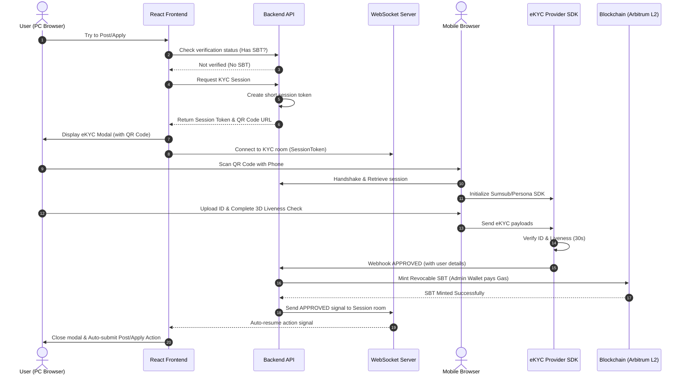

# Feature Design: Unified Platform & Trust Enhancements

## 1. Architecture Overview & Diagrams



## 2. Key Components and Responsibilities
- **Frontend App (React):** Manages local session states, opens the KYC Modal with the WebSocket-connected QR Code, and listens for the auto-resume signal.
- **Backend API (Node.js/Express):** Orchestrates container sandbox sessions, acts as the eKYC session proxy, receives webhooks, and securely interacts with the blockchain.
- **WebSocket Server:** Maintains the bidirectional connection between the PC frontend and the server during the cross-device handshake.
- **eKYC SDK / Provider:** Captures ID cards and performs 3D face liveness checks. Checks for deepfakes and fake documents.
- **Blockchain Smart Contracts (Solidity):**
  - **Dual-Deposit Escrow:** Locks 100% of the poster's bounty reward and 10% of the solver's commitment stake. Relies on the CI/CD Oracle to release funds.
  - **Soulbound Token (SBT):** An ERC-721 contract where tokens are non-transferable, minted by the Admin, and can be revoked if a user violates platform guidelines.

## 3. Technology Choices and Rationale
- **Sumsub / Persona Web SDK:** Standard eKYC provider with excellent mobile web integration, ensuring users don't need to download a native mobile app.
- **WebSockets (Socket.io):** Essential for the instant, live cross-device handshake. Real-time updates without manual polling.
- **Arbitrum/Base L2 Blockchain:** Provides extremely fast confirmation times ($<2$ seconds) and negligibly small gas fees ($< \$0.01$), making it economically viable for the platform to subsidize all SBT minting gas fees.
- **Solidity (ERC-721 base with disabled transfer overrides):** Standard Web3 contract structure for SBTs.

## 4. Data Models
### User Model
```json
{
  "_id": "ObjectId",
  "name": "string",
  "email": "string",
  "walletAddress": "string",
  "reputationScore": "number (default: 100)",
  "kycStatus": "enum (NONE, PENDING, APPROVED, REJECTED)",
  "sbtTokenId": "string (null if none)"
}
```

### Escrow Model
```json
{
  "_id": "ObjectId",
  "taskId": "ObjectId",
  "bountyAmount": "number (in ETH/Token)",
  "solverStake": "number (always 10% of bountyAmount)",
  "posterAddress": "string",
  "solverAddress": "string",
  "status": "enum (AWAITING_STAKE, ACTIVE, IN_DISPUTE, COMPLETED, REFUNDED)"
}
```

## 5. API/Interface Contracts
### 1. Request KYC Session
- **Endpoint:** `GET /api/kyc/session`
- **Auth:** Bearer Token
- **Response:**
  ```json
  {
    "success": true,
    "data": {
      "sessionToken": "kyc_sess_abc123xyz",
      "qrUrl": "https://bloodyroar.com/kyc/verify?session=kyc_sess_abc123xyz"
    }
  }
  ```

### 2. Provider Webhook
- **Endpoint:** `POST /api/kyc/webhook`
- **Auth:** HMAC Signature header (`x-kyc-signature`) to verify payload authenticity.
- **Request Body:**
  ```json
  {
    "externalUserId": "user_id_123",
    "reviewStatus": "completed",
    "reviewResult": {
      "reviewAnswer": "GREEN"
    }
  }
  ```

## 6. Major Design Decisions & Trade-offs
- **Gas Fee Subsidization:** Platform pays the gas fee for SBT minting.
  - *Trade-off:* High UX conversion rate, but introduces a continuous operation cost. Mitigated by using Arbitrum or Base Layer 2.
- **Fixed 10% Solver Stake:** Solvers must lock a constant 10% of the bug bounty amount.
  - *Trade-off:* Solid commitment to prevent developers from ghosting clients, but might limit low-balance developers from accepting high-reward bugs.
- **Revocable SBT:** SBTs can be burned by the platform Admin.
  - *Trade-off:* Allows admins to purge bad actors, but violates absolute decentralization. Deemed acceptable as the platform requires moderated compliance.
