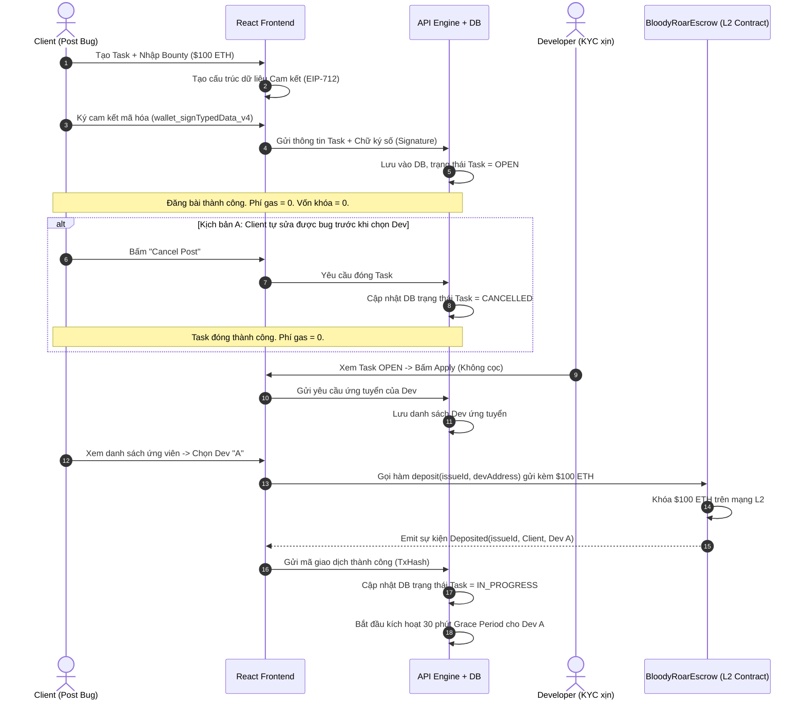

# ⚡ Đề xuất Kỹ thuật: Luồng Ký quỹ Lười (Lazy Deposit / Commitment-Based Flow)

Đề xuất thay đổi luồng ký quỹ của Khách hàng (Client) là một **cải tiến vô cùng xuất sắc về mặt tối ưu tài chính (Capital Efficiency) và trải nghiệm người dùng (UX Optimization)**.

---

## 1. Vấn đề của luồng cũ và giải pháp đột phá

### 1.1. Vấn đề của luồng cũ (Immediate Deposit)
1.  **Giam vốn vô lý (Capital Lockup):** Client đăng bài tìm Dev sửa bug. Họ phải nạp ngay lập tức $500 vào Smart Contract. Bài đăng có thể mất 3-5 ngày mới có Dev nhận. Trong thời gian đó, dòng vốn của Client bị đóng băng vô ích.
2.  **Rủi ro tự sửa được lỗi (Self-resolution Friction):** Trong lúc đợi Dev, lập trình viên nội bộ của Client tự phát hiện và sửa được bug. Để lấy lại tiền, Client phải thực hiện giao dịch rút tiền (`refund`) on-chain: tốn phí gas lần 2, chờ giao dịch xác nhận, tạo trải nghiệm bực bội.

### 1.2. Giải pháp mới: Ký quỹ Lười (Lazy Deposit) với Chữ ký Cam kết Off-chain
Thay vì nạp tiền thật ngay lúc đăng bài, Client sẽ thực hiện **Ký cam kết mã hóa (Cryptographic Commitment)** off-chain:
1.  **Đăng bài (Không tốn gas):** Client nhập thông tin bounty, sau đó dùng ví Web3 (Metamask/Rabby) ký một thông điệp mã hóa cấu trúc **EIP-712** cam kết sẽ trả phần thưởng cho task này. Chữ ký này được gửi lên Backend lưu trữ. **Không nạp tiền thật, không tốn gas, không khóa vốn.**
2.  **Hủy bài lập tức:** Nếu Client tự sửa được lỗi hoặc muốn đóng task khi chưa có Dev làm, họ chỉ cần bấm "Cancel". Hệ thống Backend đánh dấu bài đăng là `CANCELLED` mà không phát sinh bất kỳ giao dịch on-chain nào.
3.  **Ký quỹ thật (On-chain Escrow Activation):** Khi có nhiều Dev ứng tuyển (Apply), Client xem hồ sơ và chọn Dev ưng ý nhất. Lúc này, Client mới thực hiện giao dịch gửi tiền thật lên Smart Contract (`deposit`) để kích hoạt trạng thái `IN_PROGRESS` cho Dev bắt tay vào làm việc.

---

## 2. Quy trình Vận hành Chi tiết (System Sequence Diagram)

Dưới đây là sơ đồ chi tiết về luồng hoạt động mới kết hợp với cơ chế **Không bắt Dev cọc tiền** đã thống nhất ở bước trước:



---

## 3. Thiết kế Kỹ thuật chi tiết

### 3.1. Cấu trúc chữ ký cam kết EIP-712 (Off-chain Signature Schema)
Để đảm bảo tính toàn vẹn và chống giả mạo chữ ký, Client sẽ ký một cấu trúc dữ liệu chuẩn EIP-712 hiển thị rõ ràng trên ví của họ trước khi nhấn nút Đăng:

```javascript
const domain = {
  name: 'BloodyRoarPlatform',
  version: '1',
  chainId: 42161, // Arbitrum One
  verifyingContract: '0xBloodyRoarEscrowAddress...'
};

const types = {
  BountyCommitment: [
    { name: 'issueId', type: 'bytes32' },
    { name: 'client', type: 'address' },
    { name: 'bountyAmount', type: 'uint256' },
    { name: 'nonce', type: 'uint256' },
    { name: 'deadline', type: 'uint256' }
  ]
};
```
*Tác dụng:* Đảm bảo Client không thể chối bỏ cam kết tài chính khi họ thực hiện bước phê duyệt Dev. Chữ ký này có thể được Backend xác thực dễ dàng thông qua thư viện `ethers.js` (`verifyTypedData`).

### 3.2. Thay đổi trạng thái Task ở Database (Web2)
Để hỗ trợ luồng "Ký quỹ lười", thực thể Task trong cơ sở dữ liệu sẽ quản lý các trạng thái chặt chẽ:

| Trạng thái | Ý nghĩa | Hành động Tài chính |
| :--- | :--- | :--- |
| **`DRAFT`** | Bài đăng đang soạn thảo. | Chưa có chữ ký, chưa có tiền. |
| **`OPEN`** | Bài đăng hiển thị trên Marketplace cho Dev nộp đơn. | **Đã có chữ ký cam kết EIP-712** của Client. Tiền thực tế vẫn nằm trong ví Client. |
| **`IN_PROGRESS`** | Client đã chọn Dev và nạp tiền thành công. | **Tiền thật đã được khóa thành công** trên Smart Contract. |
| **`CANCELLED`** | Task bị hủy bởi Client khi đang ở trạng thái `OPEN`. | Chữ ký cam kết bị Backend vô hiệu hóa. Phí gas = 0. |

### 3.3. Cải tiến Smart Contract (`BloodyRoarEscrow.sol`)
Hàm `deposit` trên hợp đồng thông minh bây giờ sẽ là **nút kích hoạt khóa tiền công đồng thời gán thẳng Worker**:

```solidity
// BloodyRoarEscrow.sol
function deposit(bytes32 issueId, address worker) external payable whenNotPaused {
    require(msg.value > 0, "Deposit amount must be greater than 0");
    require(!escrows[issueId].isValue, "Escrow already exists for this issue");
    require(worker != address(0), "Invalid worker address");

    escrows[issueId] = Escrow({
        client: msg.sender,
        worker: worker,
        rewardAmount: msg.value, // Khóa 100% tiền công từ ví Client gửi lên
        clientStake: 0,          // Không cần cọc phụ từ Client (Đã có KYC bảo đảm)
        workerStake: 0,          // Không cần cọc từ Worker
        createdAt: block.timestamp,
        state: EscrowState.AWAITING_DELIVERY, // Vào thẳng trạng thái làm việc
        isValue: true
    });

    emit Deposited(issueId, msg.sender, worker, msg.value);
}
```

---

## 4. Kịch bản Nghiệm thu Acceptance Criteria (Gherkin-style)

### Kịch bản 1: Client đăng bài viết bug bounty mới (Lazy Post)
```gherkin
Given Client đang truy cập vào trang "Post a Task"
When Client điền bounty trị giá "0.5 ETH"
And bấm nút "Submit & Sign"
Then ví Web3 của Client hiển thị yêu cầu ký cấu trúc EIP-712 BountyCommitment
And sau khi Client ký thành công
And hệ thống Backend xác thực chữ ký hợp lệ
And lưu thông tin bài đăng cùng chữ ký vào database với trạng thái "OPEN"
And số dư ví của Client không bị trừ bất kỳ khoản ETH nào
And không có giao dịch on-chain nào được tạo ra
```

### Kịch bản 2: Client phê duyệt lập trình viên và khóa tiền thật
```gherkin
Given task "Fix Bug X" đang có trạng thái "OPEN" và có 3 Dev ứng tuyển
When Client bấm nút "Assign Dev A"
Then hệ thống kích hoạt yêu cầu giao dịch MetaMask gọi hàm deposit(issueId, DevA_Address) với số tiền "0.5 ETH"
And sau khi giao dịch on-chain được xác nhận thành công
And Smart Contract khóa 0.5 ETH trong bể ký quỹ
And hệ thống tự động cập nhật trạng thái Task trong database thành "IN_PROGRESS"
And gửi thông báo kích hoạt Sandbox tới Developer A
```

---

## 5. Kết luận

Mô hình **Lazy Deposit** kết hợp **KYC-Based trust rules** tạo nên một tổ hợp sản phẩm Web2.5 có tính cạnh tranh cực kỳ cao:
1.  **Client vô cùng thoải mái:** Họ có thể đăng hàng chục task, quản lý ngân sách linh hoạt, tự sửa được thì đóng task lập tức mà không sợ tốn gas hay kẹt vốn.
2.  **Dev hào hứng gia nhập:** Bấm nhận việc ngay lập tức không sợ mất cọc túi.
3.  **Nền tảng cực kỳ uy tín:** Dòng tiền chỉ thực sự bị khóa on-chain khi hai bên đã khớp lệnh làm việc, loại bỏ hoàn toàn các vụ tranh chấp "rút cọc rỗng" phiền phức.
