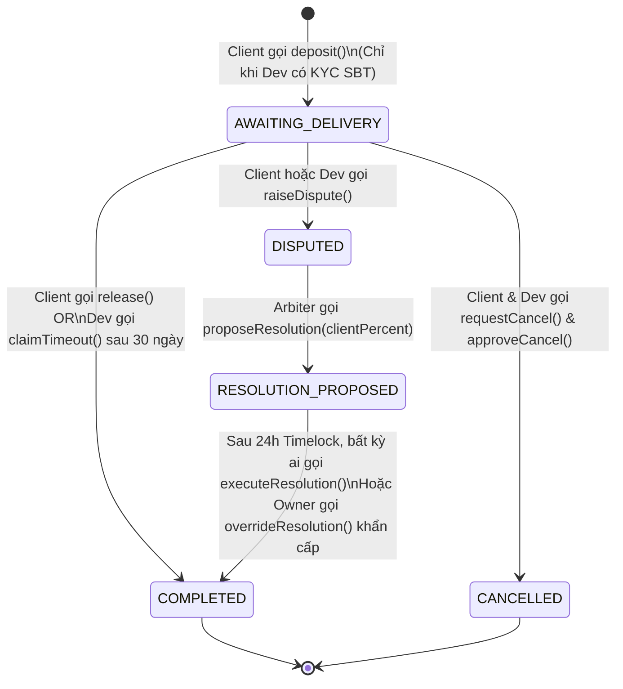
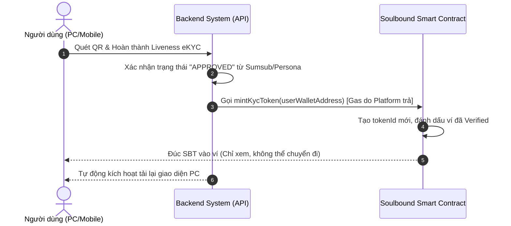

# 🏺 Phân tích Chuyên sâu & Tiến độ Hợp đồng Thông minh (Smart Contracts)

Tài liệu này cung cấp cái nhìn toàn diện về logic, luồng hoạt động, tiến độ thực tế, và **phân tích tính năng** của hệ thống Smart Contracts trên nền tảng **Bloody-Roar** phiên bản V2 (Lazy-Deposit & Zero-Stake).

Hệ thống blockchain bao gồm hai hợp đồng thông minh cốt lõi:
1.  **`BloodyRoarEscrow.sol`**: Hợp đồng Ký quỹ Lười (Lazy-Deposit Escrow) v2 — Tích hợp Timelock, Hủy đồng thuận, Giải ngân tỷ lệ và Rào cản On-chain KYC.
2.  **`KycSoulboundToken.sol`**: Hợp đồng Soulbound Token (SBT) — Cấp chứng nhận định danh số không thể chuyển nhượng.

---

## 📊 BÁO CÁO TIẾN ĐỘ (STATUS REPORT)

| Hợp đồng | Tính năng chính | Trạng thái | Tests | File nguồn |
| :--- | :--- | :--- | :--- | :--- |
| **`BloodyRoarEscrow`** | Lazy-Deposit 100%, Timeout 30 ngày, Dispute Partial Release, Timelock 24h, Mutual Cancel, Circuit Breaker | **Hoàn thành** (100%) | `EscrowHardening.test.js` (14/14 Passing) | [BloodyRoarEscrow.sol](file:///Users/admin/repos/bloody-roar/apps/blockchain/contracts/BloodyRoarEscrow.sol) |
| **`KycSoulboundToken`** | Đúc SBT, Thu hồi gian lận, Khóa chuyển nhượng qua Hook `_update` | **Hoàn thành** (100%) | `kyc.test.js` (Pass) | [KycSoulboundToken.sol](file:///Users/admin/repos/bloody-roar/apps/blockchain/contracts/KycSoulboundToken.sol) |

---

## 1. HỢP ĐỒNG KÝ QUỸ LƯỜI (`BloodyRoarEscrow.sol` v2)

### 1.1. Triết lý Thiết kế: Lazy-Deposit & Zero-Stake & On-chain Trust

Hợp đồng áp dụng mô hình **Ký quỹ Lười (Lazy Deposit)** kết hợp **Không cọc phụ (Zero Stake)** và **Kiểm duyệt Định danh (On-chain KYC)**:
*   **Client không nạp tiền khi đăng bài.** Họ chỉ ký cam kết off-chain (EIP-712).
*   **Client chỉ nạp tiền khi chọn Dev.** Gọi hàm `deposit()` nạp đúng **100% bounty** lên Smart Contract.
*   **On-chain KYC Gate:** Smart contract sẽ chặn giao dịch `deposit` nếu Developer chưa sở hữu Soulbound Token (SBT). Điều này tạo ra "Skin in the game" mạnh mẽ.
*   **Developer không cần cọc cam kết.** Dev ứng tuyển miễn phí, rủi ro bằng 0.

### 1.2. Cấu trúc Dữ liệu Escrow

```solidity
enum EscrowState { AWAITING_DELIVERY, COMPLETED, REFUNDED, DISPUTED, RESOLUTION_PROPOSED, CANCELLED }

struct Escrow {
    address client;
    address worker;
    uint256 rewardAmount;
    uint256 createdAt;
    EscrowState state;
    bool isValue;
    
    // Cancellation state
    bool cancelRequestedByClient;
    bool cancelRequestedByWorker;
    
    // Dispute resolution state
    uint256 disputeResolvedAt; // Thời điểm Arbiter đưa ra đề xuất phán quyết
    uint256 clientPercent; // Tỷ lệ % tiền hoàn lại cho Client (0-100)
}
```

### 1.3. Sơ đồ Chuyển đổi Trạng thái (State Machine)



---

### 1.4. Chi tiết các Luồng Hoạt động (Flows & Use Cases)

#### Case 1: Client nạp tiền & gán Dev (`deposit`)
*   **Kiểm tra phụ**: `require(kycToken.isVerified(worker))`
*   **Giá trị gửi kèm (`msg.value`)**: Đúng **100%** giá trị bounty.
*   **Kết quả**: Chuyển trạng thái `AWAITING_DELIVERY`.

#### Case 2: Hủy Đồng Thuận (Mutual Cancel)
*   **Logic**: Client gọi `requestCancel()`, Dev gọi `approveCancel()` (hoặc ngược lại).
*   **Kết quả**: Trạng thái `CANCELLED`, hoàn 100% tiền lại cho Client. Tránh việc kẹt vốn khi 2 bên đổi ý.

#### Case 3: Tranh chấp & Phán quyết Tỷ lệ (Partial Release)
*   **Bước 1**: Tranh chấp (`raiseDispute`) chuyển state sang `DISPUTED`.
*   **Bước 2**: Arbiter không còn phân quyết 100/0. Arbiter gọi `proposeResolution(issueId, clientPercent)`. State chuyển sang `RESOLUTION_PROPOSED`.
*   **Bước 3 (Timelock 24h)**: Phải đợi hết `challengePeriod` (24h). Trong lúc này, nếu Arbiter có dấu hiệu bị hack, `owner` có thể can thiệp bằng `overrideResolution`.
*   **Bước 4**: Hết 24h, gọi `executeResolution`. Tiền được chia theo đúng tỷ lệ. State chuyển sang `COMPLETED`.

---

## 2. HỢP ĐỒNG SOULBOUND TOKEN (`KycSoulboundToken.sol`)

Cung cấp chứng nhận số dưới dạng ERC721 không thể chuyển nhượng, ngăn chặn Sybil Attack.

### 2.1. Luồng Hoạt động



---

## 3. LỊCH SỬ NÂNG CẤP V2 (GIẢI QUYẾT 5 PAIN POINTS)

Tại phiên bản V2, chúng ta đã khắc phục hoàn toàn 5 điểm yếu rủi ro của kiến trúc V1:

### ✅ 1. Đã giải quyết: Không có "Skin in the game" cho Developer
*   **Cách giải quyết**: Tích hợp `IKycSoulboundToken` vào hàm `deposit`. Nếu Dev không có SBT (do vi phạm bị thu hồi hoặc chưa xác thực), Client sẽ bị chặn không thể nạp tiền giao task. SBT trở thành "Tài sản uy tín" mà Dev phải giữ gìn.

### ✅ 2. Đã giải quyết: Rủi ro Arbiter tập trung (SPOF)
*   **Cách giải quyết**: Áp dụng cơ chế **Timelock Challenge Period (24h)**. Arbiter không thể chuyển tiền ngay lập tức mà chỉ được quyền "Đề xuất". Owner có quyền phủ quyết (`overrideResolution`) nếu phát hiện Arbiter có dấu hiệu thao túng.

### ✅ 3. Đã giải quyết: Thiếu giải ngân tỷ lệ (Partial Release)
*   **Cách giải quyết**: Hàm giải quyết tranh chấp giờ đây hỗ trợ chia phần trăm linh hoạt (ví dụ Client 70%, Dev 30%). Tạo ra sự công bằng trong các trường hợp Dev hoàn thành một phần công việc.

### ✅ 4. Đã giải quyết: Lãng phí Storage bởi Legacy Fields
*   **Cách giải quyết**: Loại bỏ hoàn toàn `clientStake`, `workerStake` và enum `AWAITING_STAKE`, giảm tối đa gas fee.

### ✅ 5. Đã giải quyết: Client kẹt vốn khi Dev không làm
*   **Cách giải quyết**: Bổ sung hàm `requestCancel` và `approveCancel`. Tạo luồng hủy giao dịch ôn hòa mà không cần Arbiter can thiệp.

---

> 🩸 *Bloody-Roar Smart Contracts v2 — Lazy-Deposit, Zero-Stake & Timelocked Resolution.*
> *Cập nhật lần cuối: 2026-05-19.*
