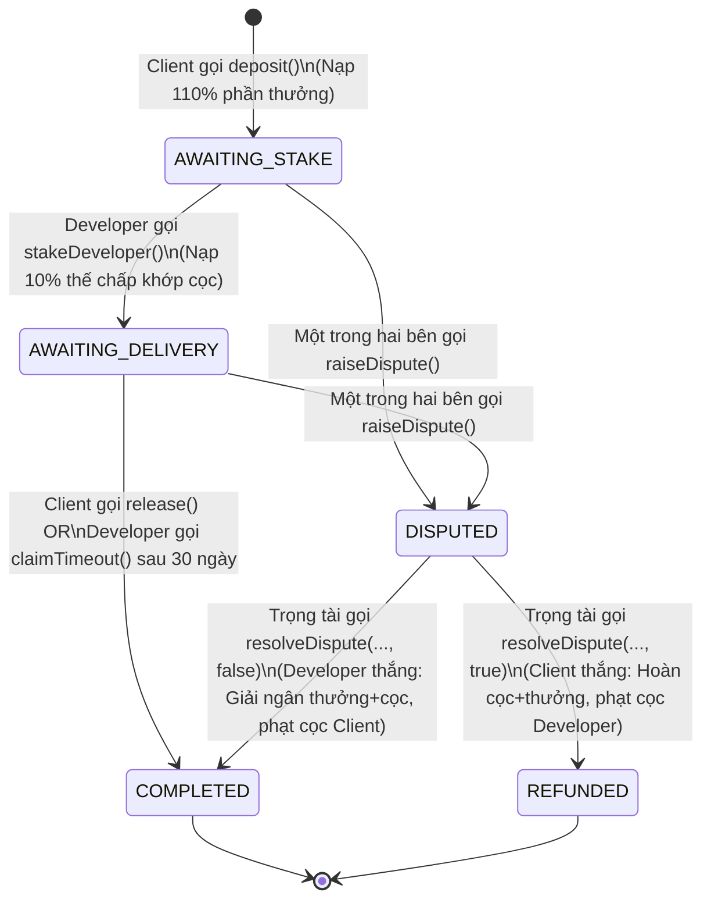
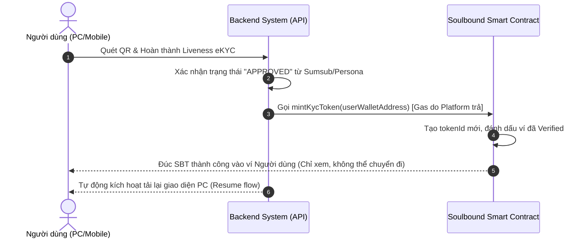

# 🏺 Phân tích Chuyên sâu & Tiến độ Hợp đồng Thông minh (Smart Contracts)

Tài liệu này cung cấp cái nhìn toàn diện và chi tiết nhất về toàn bộ logic, luồng hoạt động (flows), các trường hợp xử lý (use cases), và **tiến độ thực tế** của hệ thống Smart Contracts trên nền tảng **Bloody-Roar**.

Hệ thống blockchain của Bloody-Roar bao gồm hai hợp đồng thông minh cốt lõi được phát triển bằng Solidity, chạy trong môi trường Hardhat ở thư mục `apps/blockchain`:
1.  **`BloodyRoarEscrow.sol`**: Hợp đồng Ký quỹ kép (Dual-Deposit Escrow) đóng vai trò trung tâm đảm bảo tin cậy tài chính giữa Khách hàng (Client) và Nhà phát triển (Developer).
2.  **`KycSoulboundToken.sol`**: Hợp đồng Soulbound Token (SBT) dùng để cấp chứng nhận định danh số (eKYC) không thể chuyển nhượng cho người dùng sau khi vượt qua quy trình quét Liveness.

---

## 📊 BÁO CÁO TIẾN ĐỘ SMART CONTRACTS (STATUS REPORT)

Hệ thống Smart Contracts hiện đã hoàn thành **100% phát triển mã nguồn và kiểm thử tự động**, đạt trạng thái sẵn sàng tích hợp sản xuất (Production-Ready).

| Hợp đồng | Tính năng chính | Trạng thái | Bài kiểm tra (Tests) | File nguồn |
| :--- | :--- | :--- | :--- | :--- |
| **`BloodyRoarEscrow`** | Ký quỹ kép, Đặt cọc 10%, Rút tiền quá hạn (30 days), Cứu nguy khẩn cấp (Pause), Trọng tài phán quyết và Phạt tiền (Slashing). | **Đã hoàn thành** (100%) | `EscrowHardening.test.js` (12/12 test cases Passing) | [BloodyRoarEscrow.sol](file:///Users/admin/repos/bloody-roar/apps/blockchain/contracts/BloodyRoarEscrow.sol) |
| **`KycSoulboundToken`** | Đúc SBT định danh, Thu hồi cấm gian lận (Revocation), Cơ chế khóa chuyển nhượng thông qua Hook `_update`. | **Đã hoàn thành** (100%) | `kyc.test.js` (Tích hợp API Webhook, Test Suites Pass) | [KycSoulboundToken.sol](file:///Users/admin/repos/bloody-roar/apps/blockchain/contracts/KycSoulboundToken.sol) |

---

## 1. HỢP ĐỒNG KÝ QUỸ KÉP (`BloodyRoarEscrow.sol`)

Hợp đồng này giải quyết triệt để bài toán **"Bất đối xứng lòng tin"** bằng cách bắt buộc cả hai bên cùng đặt cọc cam kết (Dual-Deposit).

### 1.1. Cấu trúc Trạng thái ký quỹ (Escrow States)
Mỗi dự án ký quỹ được định danh qua mã `issueId` (`bytes32`) và dịch chuyển qua 5 trạng thái thông qua Máy trạng thái (Finite State Machine):
*   `AWAITING_STAKE`: Client đã nạp tiền (110% giá trị), chờ Developer đặt cọc thế chấp.
*   `AWAITING_DELIVERY`: Developer đã đặt cọc (10%), đang tiến hành xử lý nhiệm vụ.
*   `COMPLETED`: Tiền cọc và tiền công đã được giải ngân thành công (kết thúc luồng thuận lợi hoặc sau phán quyết).
*   `REFUNDED`: Client được hoàn trả lại tiền cọc và tiền công do tranh chấp hoặc lỗi từ Developer.
*   `DISPUTED`: Giao dịch bị đóng băng để Trọng tài (Arbiter) vào cuộc giải quyết.

### 1.2. Sơ đồ Chuyển đổi Trạng thái (Mermaid State Diagram)



---

### 1.3. Chi tiết các Luồng Hoạt động (Flows & Use Cases)

#### Case 1: Khởi tạo và Đặt cọc phía Khách hàng (`deposit`)
*   **Người thực hiện**: Khách hàng (Client).
*   **Giá trị gửi kèm (`msg.value`)**: Bằng đúng **110%** giá trị phần thưởng thực tế (`Bounty * 1.1`).
*   **Logic tính toán**:
    *   Phần thưởng thực tế cho công việc (`rewardAmount`) = `(msg.value * 100) / 110`.
    *   Tiền thế chấp của Client (`clientStake`) = `msg.value - rewardAmount` (tương đương 10% của Bounty).
    *   *Ví dụ: Client muốn thưởng `1.0 ETH` $\rightarrow$ Nạp vào `1.1 ETH`. Hệ thống ghi nhận `rewardAmount = 1.0 ETH`, `clientStake = 0.1 ETH`.*
*   **Kết quả**: Khởi tạo bản ghi Escrow, gán trạng thái `AWAITING_STAKE`, phát đi sự kiện `Deposited`.

#### Case 2: Đặt cọc thế chấp phía Nhà phát triển (`stakeDeveloper`)
*   **Người thực hiện**: Nhà phát triển được chỉ định (`worker`).
*   **Giá trị gửi kèm (`msg.value`)**: Phải bằng chính xác khoản tiền `clientStake` (10% Bounty).
*   **Kiểm tra điều kiện (Require checks)**:
    *   Phải đúng địa chỉ `worker` được chỉ định.
    *   Trạng thái hiện tại phải là `AWAITING_STAKE`.
    *   Giá trị cọc gửi lên phải bằng chính xác cọc của Client.
*   **Kết quả**: Tiền cọc được khóa lại. Trạng thái chuyển sang `AWAITING_DELIVERY`. Lúc này tổng số tiền hợp đồng giữ cho dự án là **120%** (`100% Bounty + 10% Client Stake + 10% Developer Stake`).

#### Case 3: Nghiệm thu và Giải ngân thành công (`release`)
*   **Người thực hiện**: Khách hàng (Client) gọi sau khi kiểm tra code hoạt động tốt.
*   **Hành động tài chính**:
    1.  **Trả cọc cho Client**: Chuyển trả lại `clientStake` (10%) về cho Client.
    2.  **Thanh toán cho Developer**: Giải ngân toàn bộ `rewardAmount` (100%) kèm tiền thế chấp đầu vào `workerStake` (10%). Tổng nhận là **110%**.
*   **Kết quả**: Trạng thái Escrow cập nhật thành `COMPLETED`, giải phóng toàn bộ số dư.

#### Case 4: Rút tiền quá hạn giải quyết (`claimTimeout`)
*   **Người thực hiện**: Nhà phát triển (Developer).
*   **Điều kiện kích hoạt**: Client biến mất, không nghiệm thu cũng không phản hồi sau **30 ngày** (`block.timestamp >= createdAt + 30 days`).
*   **Hành động tài chính**: Tương tự như hàm `release()`. Trả cọc cự ly ngắn lại cho Client (`clientStake`) để đảm bảo không chiếm dụng cọc vô lý, đồng thời giải ngân phần thưởng và cọc của Developer về ví Developer.
*   **Kết quả**: Bảo vệ tuyệt đối quyền lợi của lập trình viên trước các khách hàng vô trách nhiệm hoặc quên nhấn nút.

#### Case 5: Khởi phát Tranh chấp (`raiseDispute`)
*   **Người thực hiện**: Client hoặc Developer đều có quyền gọi khi xảy ra bất đồng.
*   **Logic**: Khóa cứng dòng tiền, chuyển trạng thái sang `DISPUTED`. Không ai có quyền rút hoặc giải ngân cho đến khi Trọng tài phán quyết.

#### Case 6: Trọng tài giải quyết Tranh chấp & Phạt tiền (`resolveDispute`)
*   **Người thực hiện**: Trọng tài được cấp quyền (`arbiter`).
*   **Các kịch bản Phán quyết (Slashing Mechanics)**:

| Phán quyết | Bên Thắng | Cơ chế phân phối Ether | Kết quả cuối |
| :--- | :--- | :--- | :--- |
| **`refundClient = true`** *(Client Thắng)* | **Client** | *   Hoàn trả **110%** cho Client (`rewardAmount` + `clientStake`).<br>*   **Cắt phạt (Slash)** 10% cọc của Developer (`workerStake`), gửi về cho Owner làm phí vận hành trọng tài. | Trạng thái cập nhật: `REFUNDED` |
| **`refundClient = false`** *(Developer Thắng)* | **Developer** | *   Giải ngân **110%** cho Developer (`rewardAmount` + `workerStake`).<br>*   **Cắt phạt (Slash)** 10% cọc của Client (`clientStake`), gửi về cho Owner làm phí vận hành trọng tài. | Trạng thái cập nhật: `COMPLETED` |

*Lợi ích kinh tế:* Cơ chế phạt này khuyến khích cả hai bên làm việc thiện chí và tự thỏa thuận thay vì lôi nhau ra trọng tài (bên thua cuộc luôn chịu tổn thất cọc thế chấp).

#### Case 7: Ngắt khẩn cấp phòng chống lỗi (`paused`)
*   **Người thực hiện**: Chủ sở hữu hợp đồng (`owner`).
*   **Hành động**: Bật/tắt cờ `paused`. Khi bị tạm dừng, các hàm nạp tiền (`deposit`, `stakeDeveloper`) sẽ bị chặn đứng để bảo vệ quỹ tiền tệ của nền tảng khi có sự cố.

---

## 2. HỢP ĐỒNG SOULBOUND TOKEN CHỨNG NHẬN ĐỊNH DANH (`KycSoulboundToken.sol`)

Hợp đồng này cung cấp chứng nhận số dưới dạng token ERC721 không thể chuyển nhượng nhằm ngăn chặn gian lận danh tính (Multi-accounting, Sybil Attack).

### 2.1. Logic cốt lõi (Soulbound Lock)
Đặc tính cốt lõi của Soulbound Token (SBT) là **không thể mua bán hoặc chuyển nhượng**. Điều này được thực thi bằng cách ghi đè (override) hàm nội bộ `_update` từ tiêu chuẩn ERC721 của OpenZeppelin:

```solidity
function _update(address to, uint256 tokenId, address auth) internal override returns (address) {
    address from = _ownerOf(tokenId);
    
    // Ngăn chặn toàn bộ các giao dịch chuyển nhượng giữa các ví khác 0 (tức là chuyển nhượng sau khi đúc)
    if (from != address(0) && to != address(0)) {
        revert("Soulbound: Transfer is forbidden");
    }
    
    return super._update(to, tokenId, auth);
}
```
*   **Đúc token (`from == address(0)`)**: Hợp lệ.
*   **Thu hồi/Đốt token (`to == address(0)`)**: Hợp lệ.
*   **Giao dịch giữa hai ví (`from != 0 && to != 0`)**: Bị chặn đứng và hoàn tác (`revert`).

### 2.2. Chi tiết các Luồng Hoạt động (Flows & Use Cases)



#### Case 1: Đúc Token khi hoàn thành định danh (`mintKycToken`)
*   **Người thực hiện**: Chỉ duy nhất Chủ sở hữu nền tảng (`owner` / API Webhook) được gọi.
*   **Logic**:
    *   Kiểm tra ví nhận không được là địa chỉ `0x0`.
    *   Kiểm tra ví nhận chưa từng sở hữu SBT nào trước đó (mỗi người chỉ được định danh 1 lần).
    *   Đúc NFT chứa mã định danh duy nhất cấp cho ví đó, đánh dấu `_isKycVerified[to] = true`.
*   **Kết quả**: Người dùng sở hữu SBT định danh vĩnh viễn, giao diện tự động cập nhật trạng thái "Đã xác minh".

#### Case 2: Thu hồi Token khi phát hiện gian lận (`revokeKycToken`)
*   **Người thực hiện**: Chủ sở hữu nền tảng (`owner`).
*   **Logic**:
    *   Kiểm tra người dùng thực sự đang sở hữu token định danh.
    *   Thực hiện đốt (`_burn`) token dựa theo mã lưu trữ.
    *   Thu hồi quyền xác minh: Đặt trạng thái `_isKycVerified[user] = false`.
*   **Kết quả**: Token biến mất khỏi ví, tài khoản người dùng bị hạ cấp về trạng thái chưa xác thực (Unverified).

#### Case 3: Truy vấn trạng thái KYC (`isVerified`)
*   **Người thực hiện**: Bất kỳ thực thể nào (Frontend, Backend, các Smart Contract khác).
*   **Logic**: Đọc dữ liệu công khai từ ánh xạ `_isKycVerified[address]` để quyết định xem người dùng đó có đủ độ tin cậy để nhận/đăng bounty cao hay không.

---

## 3. BẢO MẬT & QUẢN TRỊ RỦI RO (SECURITY & RISK MITIGATION)

Hệ thống hợp đồng thông minh đã được hardening dựa trên các tiêu chuẩn bảo mật Web3 tiên tiến nhất:

1.  **Chống tràn số (Math safety)**: Sử dụng Solidity `^0.8.20` và `^0.8.24` tích hợp sẵn cơ chế tự động revert giao dịch khi xảy ra tràn số (overflow/underflow), loại bỏ rủi ro toán học.
2.  **Thiết kế CEI (Checks-Effects-Interactions)**: Mọi thao tác ghi nhận thay đổi trạng thái trong Escrow đều được thực thi *trước* khi thực hiện lệnh gửi Ether để ngăn ngừa triệt để các cuộc tấn công tái nhập (**Reentrancy Attack**).
3.  **Hạn chế quyền tối đa (Least Privilege)**:
    *   Quyền phán quyết tranh chấp bị khóa cứng cho duy nhất địa chỉ ví `arbiter`.
    *   Quyền tạm dừng và thay đổi tham số quản trị chỉ dành cho `owner`.
