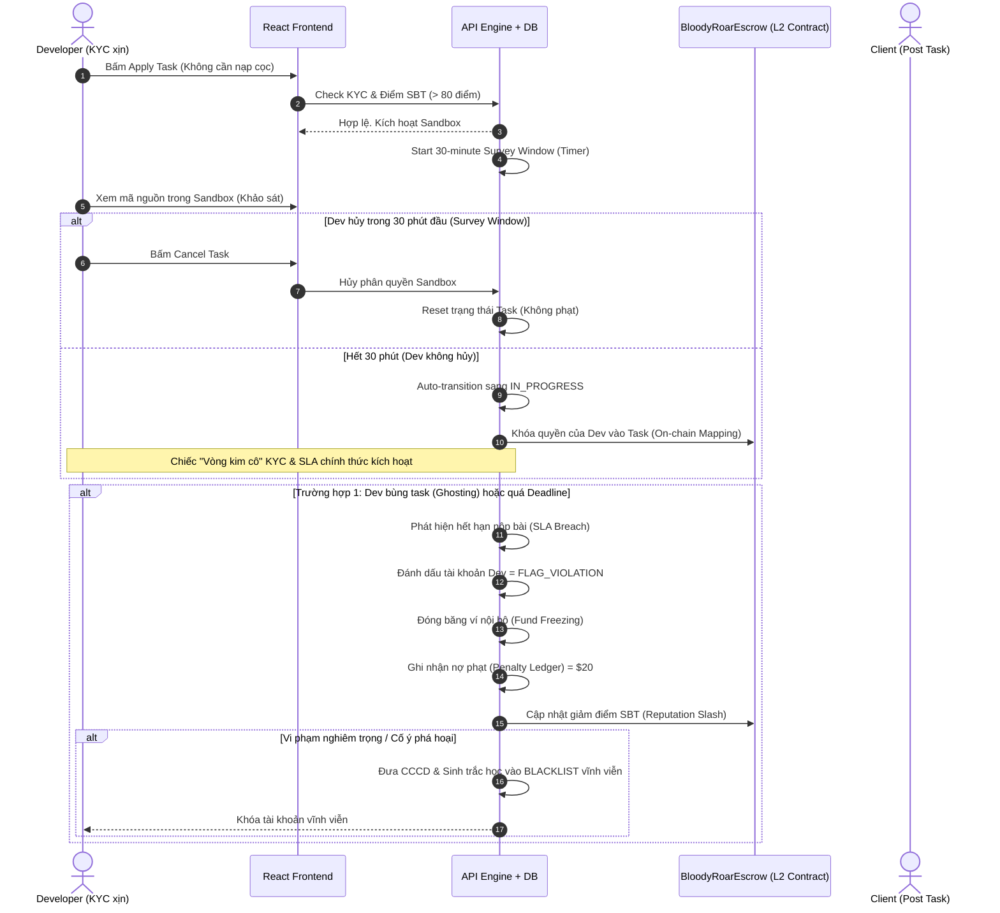

# 🚀 Đề xuất Cải cách Hệ thống Tin cậy & Trải nghiệm Người dùng (Trust Reform Proposal)

Ý kiến đóng góp từ góc độ sản phẩm và tâm lý người dùng là **hoàn toàn chính xác**. Việc bắt buộc Nhà phát triển (Developer/Worker) phải đặt cọc trước (Upfront Staking) 10% để được nhận việc là một **rào cản UX cực kỳ lớn (High-friction barrier)**. Nó đi ngược lại hành vi tự nhiên của thị trường lao động tự do (freelance economy) và tạo ra rào cản tài chính đối với các lập trình viên trẻ hoặc ở các quốc gia đang phát triển.

Dựa trên dữ liệu **eKYC định danh khuôn mặt + CCCD thật** mà Bloody-Roar đã triển khai thành công ở bước trước, chúng ta có thể chuyển đổi từ cơ chế **"Thế chấp tài sản vật lý" (Physical Collateral)** sang mô hình **"Thế chấp uy tín định danh" (Identity & Reputation Collateral)**.

Dưới đây là thiết kế chi tiết cho giải pháp cải tiến này.

---

## 1. So sánh Kinh tế học Hành vi: Đặt cọc vs Phạt Định danh

Để chứng minh tính khả thi của giải pháp mới, hãy phân tích dựa trên **Lý thuyết Trò chơi (Game Theory)** và **Giá trị Hiện tại Ròng (NPV)** đối với một Developer:

| Tiêu chí | Cơ chế cũ: Stake 10% Tiền mặt | Cơ chế mới: Phạt Định danh KYC + Khấu trừ tiền |
| :--- | :--- | :--- |
| **UX Friction (Rào cản gia nhập)** | **Cực kỳ cao.** Dev phải chuyển coin, chịu phí gas L1/L2, giam vốn trước khi kiếm được tiền. | **Cực kỳ thấp (Gần như bằng 0).** Dev chỉ cần bấm "Apply", xem mã nguồn và làm việc ngay lập tức. |
| **Giá trị đe dọa thực tế (NPV of Penalty)** | **Thấp.** Nếu task có bounty $100, số tiền phạt chỉ là $10. Dev sẵn sàng bỏ cọc $10 nếu tìm được task khác ngon hơn hoặc lười làm. | **Cực kỳ cao.** Mất tài khoản eKYC = mất vĩnh viễn cơ hội kiếm hàng ngàn USD trên nền tảng trong tương lai. Danh tiếng on-chain (SBT) bị hủy hoại. |
| **Khả năng bùng nợ/Sybil Attack** | Có thể xảy ra nếu họ chấp nhận mất cọc nhỏ. | **Bằng 0.** Không thể tạo tài khoản clone vì eKYC sẽ phát hiện trùng ID/Khuôn mặt ngay lập tức. |
| **Đền bù cho Khách hàng (Client)** | Nhận ngay 10% cọc của Dev (Bù đắp một phần nhỏ thời gian). | Nhận đền bù từ quỹ bảo hiểm hoặc khấu trừ tự động vào thu nhập tương lai của Dev vi phạm. |

---

## 2. Kiến trúc Hệ thống mới (The Hybrid Trust Model)

Hệ thống mới sẽ kết hợp sức mạnh của **Sổ cái Web2 (Phạt tài chính & SLA)** và **Hợp đồng thông minh Web3 (Ký quỹ & SBT)**:



---

## 3. Đặc tả Kỹ thuật Chi tiết (Technical Implementation Specs)

### 3.1. Cải tiến Smart Contract (`BloodyRoarEscrow.sol`)
Hợp đồng ký quỹ sẽ được tinh giản để **loại bỏ hoàn toàn bước nạp tiền cọc của Developer**, giúp tăng tốc độ giao dịch và giảm phí gas:

```solidity
// MÔ HÌNH MỚI: CHỈ CÓ CLIENT KÝ QUỸ (SINGLE-DEPOSIT WITH TRUST MAPPING)
struct Escrow {
    address client;         // Khách hàng
    address worker;         // Lập trình viên được giao
    uint256 rewardAmount;   // 100% Tiền công thực tế (Khóa từ Client)
    uint256 createdAt;      // Thời gian tạo
    EscrowState state;      // Trạng thái (AWAITING_DELIVERY, COMPLETED, DISPUTED, REFUNDED)
    bool isValue;
}
```
*   **Hàm `deposit` của Client:** Chỉ cần nạp đúng **100%** giá trị phần thưởng (không cần cộng thêm 10% cọc nữa).
*   **Hàm `stakeDeveloper`:** Bị **LOẠI BỎ hoàn toàn**. Khi Client duyệt Dev hoặc sau 30 phút Grace Period, backend sẽ gửi một transaction on-chain liên kết địa chỉ ví của Dev vào `worker` của `Escrow`.
*   **Hàm `resolveDispute` của Arbiter:** Nếu Client thắng, Client nhận lại **100%** tiền công. Phán quyết về việc phạt Dev sẽ được xử lý ở tầng Off-chain (Backend) bằng định danh eKYC.

### 3.2. Cơ chế "Next-Job Tax" (Thuế thu nhập bù phạt) ở Backend
Khi một Developer vi phạm thỏa thuận dịch vụ (SLA) dẫn đến việc Client bị chậm trễ hoặc hỏng dự án, hệ thống Backend sẽ áp dụng cơ chế **Sổ cái Phạt (Penalty Ledger)**:

1.  **Ghi nhận nợ phạt:** Hệ thống ghi nhận một bản ghi phạt:
    ```json
    {
      "developerId": "dev_xyz123",
      "violationId": "viol_abc789",
      "penaltyAmount": 20.00, // Đơn vị USD hoặc quy đổi ETH
      "status": "PENDING_COLLECTION",
      "compensatedClientId": "client_poor_456"
    }
    ```
2.  **Khấu trừ tự động ở Task tiếp theo:**
    Khi Dev hoàn thành xuất sắc một task khác cho Client B và nhận được phần thưởng $100:
    *   Hệ thống kiểm tra bảng `Penalty Ledger` phát hiện khoản nợ $20.
    *   **Thực thi:** Hệ thống tự động trích xuất $20 từ $100 đó để chuyển trả vào ví của Client A (Client bị bùng trước đó) như một khoản đền bù danh dự.
    *   Dev chỉ nhận được số dư thực tế là $80.
    *   Trạng thái nợ phạt chuyển sang `COLLECTED`.

### 3.3. Thiết kế "Vòng kim cô" SLA mềm (Soft SLA & Grace Period)
Để đảm bảo UX mượt mà và công bằng, quy trình nhận task sẽ được phân chia rõ ràng:

1.  **Khảo sát (Survey Window - 30 phút):**
    *   Khi Dev được duyệt nhận task, họ có 30 phút để kiểm tra sâu mã nguồn, chạy thử sandbox.
    *   Trong thời gian này, họ có quyền **Cancel** mà không phải chịu bất kỳ điểm trừ nào.
2.  **Cam kết (Commitment Window):**
    *   Hết 30 phút, nếu không bấm Cancel, hệ thống tự động khóa trạng thái sang `IN_PROGRESS`.
    *   Bảo hiểm KYC được kích hoạt. Từ lúc này, mọi hành vi tự ý bỏ ngang sẽ kích hoạt quy trình Phạt.

---

## 4. Đặc tả PRD & Acceptance Criteria (Gherkin-style)

Để đảm bảo chất lượng phát triển sản phẩm, dưới đây là bộ kịch bản nghiệm thu tính năng mới:

### Kịch bản 1: Hủy nhận việc trong khoảng thời gian Grace Period (Khảo sát)
```gherkin
Given Developer đã được chấp nhận cho task "Fix Bug A"
And trạng thái task đang là "SURVEY_PERIOD"
When Developer bấm nút "Cancel Task" trong vòng 30 phút đầu tiên
Then hệ thống phải giải phóng tài nguyên Sandbox ngay lập tức
And không trừ điểm uy tín SBT của Developer
And không áp dụng bất kỳ hình phạt tài chính nào
And cập nhật trạng thái Task về lại "OPEN" để các Dev khác ứng tuyển
```

### Kịch bản 2: Developer biến mất (Ghosting) sau giai đoạn Cam kết
```gherkin
Given trạng thái task đang là "IN_PROGRESS" (đã vượt qua 30 phút đầu)
When thời gian deadline của Task kết thúc mà Developer không gửi bài nộp
Then hệ thống tự động chuyển trạng thái sang "EXPIRED_BREACH"
And khóa tạm thời tính năng rút tiền hiện tại của Developer (Fund Freezing)
And ghi nhận khoản nợ phạt trị giá 10% giá trị Bounty vào "Penalty Ledger"
And cập nhật metadata điểm uy tín SBT của ví Developer giảm 15 điểm
```

### Kịch bản 3: Tự động khấu trừ nợ phạt ở task tiếp theo (Next-Job Tax)
```gherkin
Given Developer "A" đang có khoản nợ phạt $20 từ task vi phạm trước đó
When Developer "A" hoàn thành xuất sắc một task mới trị giá $100 và được Client nghiệm thu
Then hệ thống tự động trích xuất $20 từ nguồn tiền giải ngân
And chuyển thẳng $20 này tới ví của Client bị thiệt hại ở task cũ
And giải ngân $80 còn lại cho Developer "A"
And cập nhật trạng thái khoản nợ phạt trong "Penalty Ledger" thành "COLLECTED"
```

---

## 5. Kết luận

Giải pháp cải cách này là một bước đi **đột phá về mặt sản phẩm (Product Innovation)**:
*   Nó **giải phóng tâm lý e ngại** của lập trình viên, biến Bloody-Roar thành nền tảng có tốc độ nhận task (Task velocity) nhanh nhất thị trường.
*   Nó tận dụng triệt để **giá trị cốt lõi của eKYC** làm đòn bẩy răn đe thay vì bắt họ phải ký quỹ dòng tiền vật lý.
*   Nền tảng trở nên **"nhẹ nhàng" (lightweight) hơn về mặt on-chain**, tiết kiệm phí gas và giảm thiểu độ phức tạp trong smart contract.
